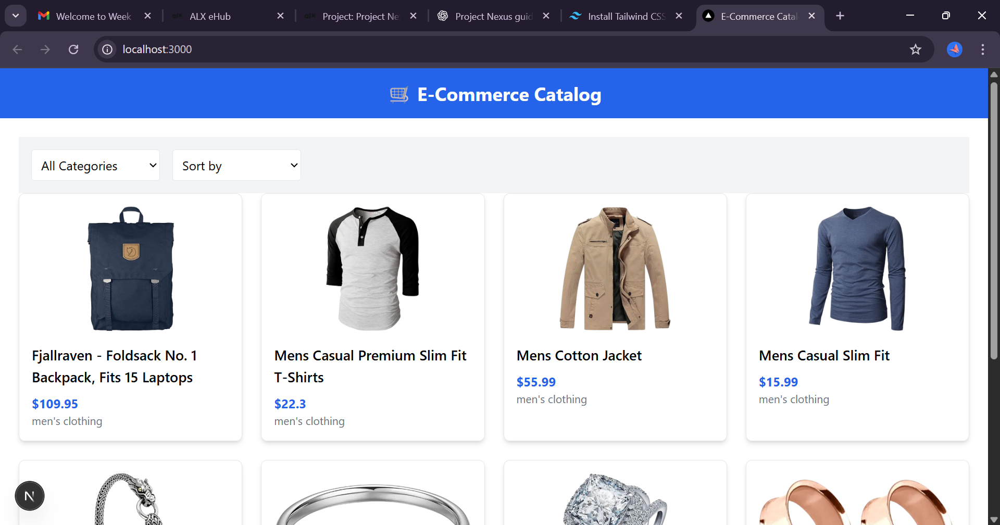
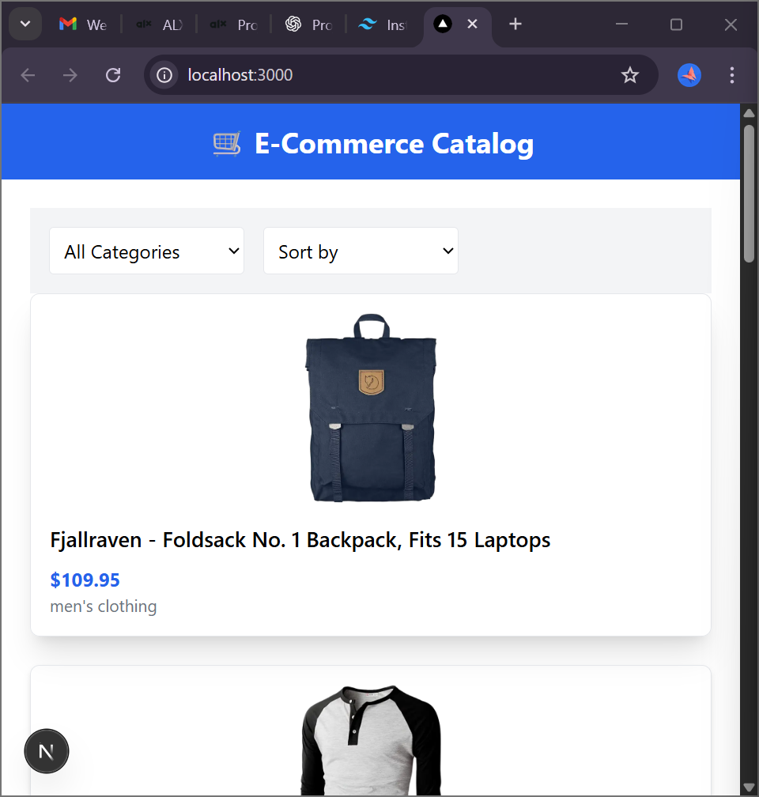

# E-Commerce Product Catalog

A dynamic, responsive e-commerce product catalog built with **Next.js, Redux, TypeScript, and Tailwind CSS**.  
This project is submitted as part of **Project Nexus - ProDev Frontend**.

## Features

- **API Integration:** Fetches product data dynamically from a backend API.
- **Filtering & Sorting:**
  - Category filtering
  - Price ascending/descending
  - Multi-criteria filtering
- **Pagination & Infinite Scrolling:** Seamless browsing experience for large datasets.
- **Responsive Design:** Optimized for desktop, tablet, and mobile devices.
- **Redux State Management:** Efficient global state handling.

## Tech Stack

- **Frontend:** Next.js, React, TypeScript
- **Styling:** Tailwind CSS
- **State Management:** Redux Toolkit
- **Deployment:** Vercel / Netlify (to be added)

## Installation

```bash
git clone <https://github.com/Hanan-3450/alx-ecommerce-catalog>
cd e-commerce-catalog
npm install
npm run dev


## Hosted Project Link

[View the live project here](https://ecommerce-d6k8bl9go-hanan-3450s-projects.vercel.app)

## Project Screenshots

### Desktop View
### Desktop View


### Mobile View


## Demo Video
[Watch the Demo Video](https://drive.google.com/drive/folders/1xxhjqww1ZsB2CHf6EKq5stf__kosSv9Z?usp=sharing)


